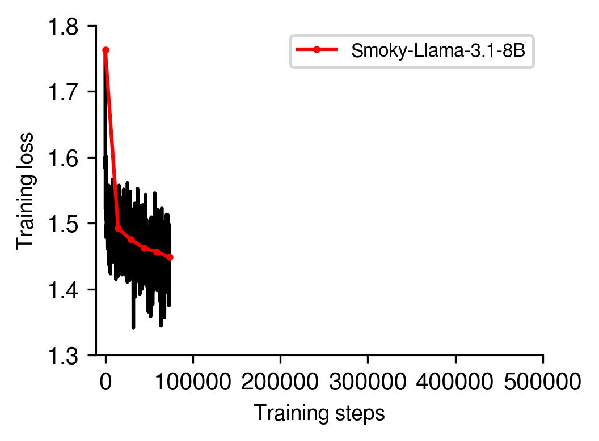

## Experiments with `torchtitan` on Frontier

This is a copy of the [`torchtitan`](https://github.com/pytorch/torchtitan) library that I use to run LLM training experiments on Frontier. 

### Prerequisites
* Install PyTorch nightly with ROCm 6.3:
```bash
pip install --pre torch torchvision torchaudio --index-url https://download.pytorch.org/whl/nightly/rocm6.3
```
My PyTorch-ROCm version is nightly `2.7.0.dev20250221+rocm6.3` and I think a reasonably recent nightly version is necessary to reproduce the results below.

* Clone this repo and install the following packages:
```bash
pip install datasets torchdata tomli tensorboard sentencepiece tiktoken blobfile tabulate ninja
``` 

* Download the Llama-3.1-8B tokenizer:

```python 
python torchtitan/datasets/download_tokenizer.py --repo_id meta-llama/Meta-Llama-3.1-8B --tokenizer_path "original" --hf_token=...
```

where `hf_token` is your Hugging Face Hub token.

* Unlike for CUDA, you will need to install FlashAttention-2 for ROCm separately. [This page](https://rocm.docs.amd.com/en/latest/how-to/llm-fine-tuning-optimization/model-acceleration-libraries.html) provides the instructions for that. Basically, to install from source:

```bash
git clone https://github.com/ROCm/flash-attention.git
cd flash-attention/
GPU_ARCHS=gfx90a python setup.py install  # MI200 series
```
Here, `gfx90a` is the correct GPU architecture choice for MI250X. In the last step, make sure to build with `ninja` (`pip install ninja` if it's not already installed), otherwise it might take forever. Before running the above, make sure to set your ROCm home directory correctly for the installation to proceed: *e.g.* `export ROCM_HOME=/opt/rocm-6.3.1` for ROCm 6.3; also set `export MAX_JOBS=64` or something large like that to speed up the installation.

* Install the `aws-ofi-rccl` plugin, which enables `rccl` (AMD ROCm's version of `nccl`) to use `libfabric` for a more performant interconnect. I provide a shell script here ([`aws_ofi_rccl.sh`](https://github.com/eminorhan/frontier-torchtitan/blob/master/aws_ofi_rccl.sh)) to install this plugin. Simply run this script (*e.g.* `sh aws_ofi_rccl.sh`) to install the plugin (the script assumes that your ROCm version is 6.3.1 and the `libfabric` version is 1.22.0; if you're using different versions, change it accordingly).

### Pretraining data
Currently, the pretraining data consist of a combination of the following datasets:

* [Zyda-2](https://huggingface.co/datasets/Zyphra/Zyda-2), which is itself a cross-deduplicated and filtered combination of DCLM (3.3T), FineWeb-Edu (1.3T), Dolma (0.2T), Zyda (0.2T).

* Stack-2: the [`the-stack-v2-train-smol-ids`](https://huggingface.co/datasets/bigcode/the-stack-v2-train-smol-ids) subset (525B).

* [`FineMath`](https://huggingface.co/datasets/HuggingFaceTB/finemath): the `finemath-3plus` subset (34B).

The numbers in parentheses represent the approximate token counts (the full dataset has ~5.56T tokens). The subdirectory [`download_scripts`](https://github.com/eminorhan/frontier-torchtitan/tree/master/download_scripts) contains basic Python scripts to download these datasets. The mixture weights for these components are currently as follows (in terms of data rows, not tokens): DCLM (40%), FineWeb-Edu (44%), Dolma (3%), Zyda (2%), Stack-2 (10%), FineMath (1%).

### Data loading strategy
The data loading strategy is currently as follows (implemented [here](https://github.com/eminorhan/frontier-torchtitan/blob/master/torchtitan/datasets/hf_datasets.py)):

* load individual component datasets in streaming mode (as iterable datasets)
* interleave the component datasets using `ds.interleave_datasets()`
* shuffle the combined dataset with a large buffer size (`buffer_size=100000`) and a globally shared random seed
* split the dataset across `dp` (data-parallel) ranks using `ds.split_dataset_by_node()`

The shuffle is performed once at the beginning of each training session with a fresh global random shuffling seed (due to job runtime limits on Frontier, each session takes 24 hours at most after which we checkpoint and restart again). The shuffle operation shuffles the dataset shards as well as the rows in the buffer and the large buffer size ensures that all data rows in the shard get a chance to be consumed during a ~24 hour training session.

This data loading pipeline is preferred over the one implemented in the torchtitan library ([here](https://github.com/pytorch/torchtitan/blob/main/torchtitan/datasets/hf_datasets.py)), which checkpoints a `_sample_idx` variable and attempts to skip to that idx at the beginning of the next training session, since I couldn't verify that this implementation works correctly (I observed that after resuming the checkpoint, the data loader would keep sampling some of the same data rows from the previous sessions, which should have been skipped).

### Training
The SLURM batch script in [`train_8B_n64.sh`](https://github.com/eminorhan/frontier-torchtitan/blob/master/train_8B_n64.sh) can be used to train a Llama-3.1-8B model with a context size of 8192 tokens over 64 Frontier nodes. This script uses the training config file in [`train_configs/llama3_8b_n64.toml`](https://github.com/eminorhan/frontier-torchtitan/blob/master/train_configs/llama3_8b_n64.toml). Feel free to modify the config according to your needs.

### A note on IP network interfaces
For loading and saving distributed checkpoints, the code uses the `torch.distributed.checkpoint` (DCP) library. A new process group with the `gloo` backend is created for this purpose (separate from the process group used by `nccl` for training). In my experience, the IP network interface to be used by both `gloo` and `nccl` needs to be explicitly set to `hsn0`, *i.e.*:
```bash
export NCCL_SOCKET_IFNAME=hsn0
export GLOO_SOCKET_IFNAME=hsn0
```
Otherwise, it becomes impossible to run on more than ~300 nodes due to communication failures.

### Checkpoint conversions
Two utility scripts to convert checkpoints between `DCP` and `torch.save` formats are provided here. [`llama_to_dcp.py`](https://github.com/eminorhan/frontier-torchtitan/blob/master/llama_to_dcp.py) converts a checkpoint saved with `torch.save` to `DCP` format. This is useful when initially converting the original Llama-3 checkpoints into `DCP` format to continue pretraining them with the code in this repository (you will most likely need to use this only once before starting continued pretaining). You can do this as follows:
```bash
python llama_to_dcp.py --input_dir INPUT_DIR --output_dir OUTPUT_DIR
```
where `INPUT_DIR` is the directory where the original checkpoint is saved (downloaded from [here](https://huggingface.co/meta-llama/Llama-3.1-8B/tree/main/original) for the 8B model) and `OUTPUT_DIR` is the directory where the `DCP` checkpoint will be saved. The bulk of this script was copied from [this PR](https://github.com/pytorch/torchtitan/commit/3247841423429faf37bdf6918204350db293e482) by [`rlsl (Rasmus)`](https://github.com/rlrs). 

For the conversion in the other direction (`DCP --> torch.save`), you can use the [`dcp_to_llama.py`](https://github.com/eminorhan/frontier-torchtitan/blob/master/dcp_to_llama.py) script like so:
```bash
python dcp_to_llama.py --input_dir INPUT_DIR --output_dir OUTPUT_DIR
```
where `INPUT_DIR` now holds the `DCP` checkpoint and the `.pth` checkpoint will be saved in `OUTPUT_DIR`. You will need to do this conversion to evaluate the intermediate checkpoints. Optionally, you can also push the intermediate checkpoints (converted into `.pth` format) to huggingface by passing the argument `--push_to_hub`.

### Evaluation
After converting the checkpoints to `.pth` format, you can evaluate them on some downstram tasks using the [eval_ckpt.sh](https://github.com/eminorhan/frontier-torchtitan/blob/master/eval_ckpt.sh) script. This requires installing `torchtune` (*e.g.*, `pip install torchtune`) and `lm-evaluation-harness` (as described [here](https://github.com/EleutherAI/lm-evaluation-harness?tab=readme-ov-file#install)). Running an evaluation is then basically as easy as:
```bash
tune run eleuther_eval --config CONFIG_FILE
```
where `CONFIG_FILE` is the configuration file for the particular evaluation you want to run (see [eval_ckpt.sh](https://github.com/eminorhan/frontier-torchtitan/blob/master/eval_ckpt.sh) for concrete examples). The [`eval_configs`](https://github.com/eminorhan/frontier-torchtitan/tree/master/eval_configs) directory contains configuration files for some common evaluation tasks.

### Results
#### Training progress
Training data and config as described above: 64 nodes, 11M tokens globally per training step, peak learning rate: `3e-5`, planned training steps: 500K.

Current training step: 73500



Black trace is the loss tracked in 100-step bins, red trace is the loss tracked in 15000-step bins.

#### Head-to-head comparison between A100 *vs.* MI250X GPUs (8 nodes)
`torchtitan` repo provides performance benchmarks for training Llama-3 8B with context size 8192 on 64 A100 GPUs (8 nodes) [here](https://github.com/pytorch/torchtitan/blob/main/docs/performance.md). Specifically, they report a `wps` of ~2900 (tokens/second) and `mfu` of ~58% (model flops utilization) for a particular set-up. I replicated the same set-up on 8 Frontier nodes with 64 GCDs (FSDP2 only parallelism, selective (`op`-based) activation checkpointing, `layernorm` nonlinearity, no `torch.compile`, and a local batch size of 1) and observed a `wps` of ~1333 and `mfu` of ~40%. This is ~1.5-2.2x worse than the A100 results. Despite occasional [reports](https://www.databricks.com/blog/training-llms-scale-amd-mi250-gpus) I see claiming that AMD MI250X is competitive with NVIDIA A100, MI250X performs significantly worse than A100 on serious AI workloads in my experience. This difference is likely mostly due to the advantage in interconnect NVIDIA has over AMD with NVLink and NCCL (see also below).

You can run this benchmark with the SLURM batch script [`train_8B_n8_benchmark.sh`](https://github.com/eminorhan/frontier-torchtitan/blob/master/train_8B_n8_benchmark.sh), which uses the benchmark configuration in [`train_configs/llama3_8b_n8_benchmark.toml`](https://github.com/eminorhan/frontier-torchtitan/blob/master/train_configs/llama3_8b_n8_benchmark.toml).

#### Scaling up on Frontier
I've been able to scale Llama-3 8B training with FSDP2 + DP + TP (`dp_shard` + `dp_replicate` + `tp`) up to 640 nodes (5120 GCDs) on Frontier. With `dp_shard=32`, `dp_replicate=20`, `tp=8`, and a batch size per `dp_degree` of 21, this setup consumes a hefty 110M tokens per update globally (`32*20*21*8192`). The wall-clock time per update is around ~0.6 minute, so this setup would take around ~3.8 days to go through 1T tokens. However, this setup doesn't work reliably unfortunately. Out of 10 attempts, I would be lucky if 4-5 worked successfully. Large-scale runs on a large number of nodes are regrettably, disappointingly finicky on Frontier. Increasing the node count beyond 640 (by increasing `dp_replicate`) almost always fails in my experience.
